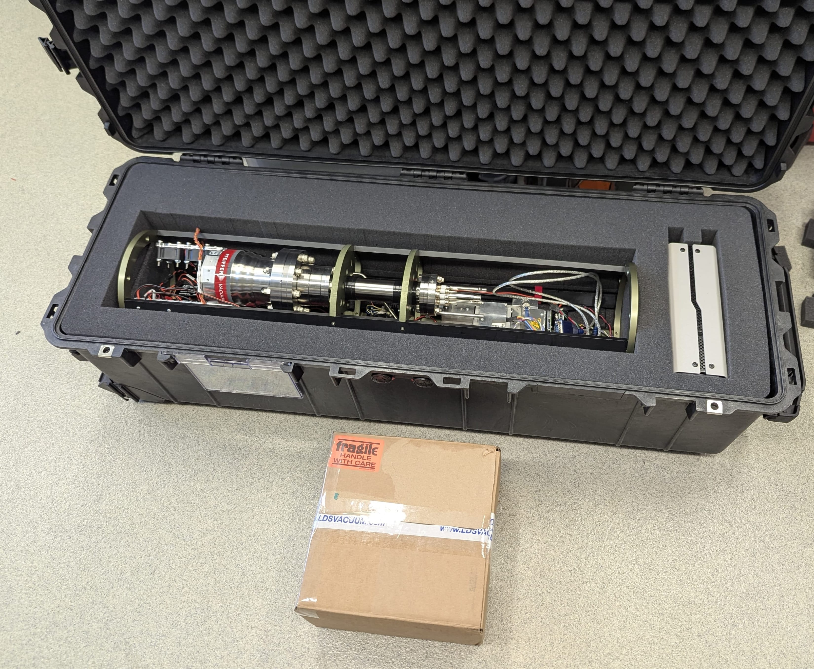

# In-Situ Mass Spectrometer V3

NOTE this branch is specifically for the 2026 ISMS made for IFEMER.
The main branch is for the current standard version of the ISMS made by the Girguis Lab

This branch contains two separate firmwares:
 1. Modern version (to be compiled in the VSCode + Platform.io IDE)
    Source code is found in the ./Src and Lib folders, to compile open the full repository in VSCode with the platformio extension and use the compile and upload button provided by the Platformio extension to upload firmware to the onboard Arduino Mega.
 2. Legacy-interface-compatible version (to be compiled in the Arduino IDE)
    Source code is found in the ./Legacy-ISMS-firmware-Ifremer-2026 folder. Open in Arduino IDE and compile/upload to the onboard Arduino Mega.

IFREMER-specific documentation and notes can be found in the Ifremer-documentation folder.

----
