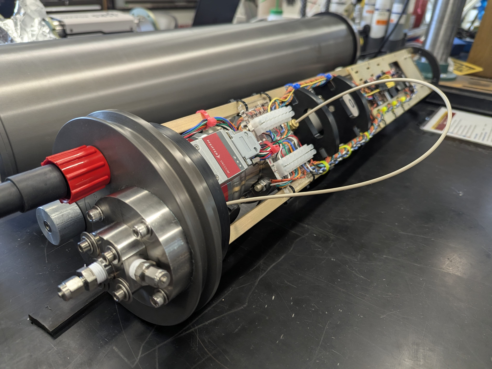

# In-Situ Mass Spectrometer V3

*__This repository contains the documentation and code for fabricating and operating version 3 of the Girguis Lab In-Situ Mass Spectrometer.__*

The In-Situ Mass Spectrometer (ISMS) is an open source biogeochemistry instrument for studying how disolved gases and volatile compounds influence ecosystems and processes in the ocean depths. It is designed as a membrane inlet mass spectrometer based on a commercially available quadrupole mass spectrometer. The ISMS is capable of detecting and quantifying volatiles up to 200 daltons at depths down to 4,500 m.

## Repository Organization:

* / [documentation](./documentation/)
 All documentation lives in this folder.

    * / [Operation](./documentation/Operation/README.md): 
    Operation instructions for using ISMSs in the field and in the lab.

    * / [Fabrication](./documentation/Fabrication/README.md): 
    Fabrication instructions to create new ISMSs including BOMs, PCB layouts, CAD designs, and engineering drawings

    * / [Calibration & Testing](<./documentation/Calibration & Testing/README.md>): 
    Methods for calibration and testing of the ISMS

* / [src](./src): 
The code that runs on the ATMEL microcontroller inside the ISMS lives in the /src folder as well as the /lib and /test folders.

## Contributing

The Girguis Lab is an open-source/open-design facility. We strongly believe that an “open source” approach to disseminating technologies enables more rapid discovery and more efficient use of our community’s limited financial resources. When partnering with commercial entities, we make every effort to encourage “open source” approaches to development, and to ensure that any co-developed technologies are—at the very least—available to academic scientists at a reasonable price.
Contributions and pull req
