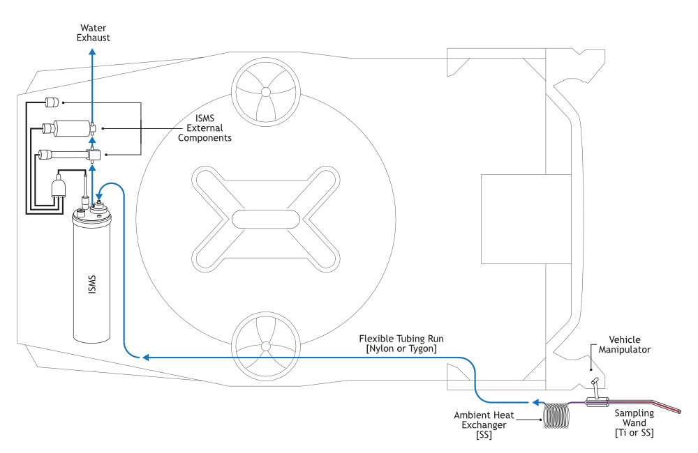

# ISMS V3 Vehicle Integration Guide

The ISMS can be integrated into various vehicles and platforms. It is powered off of two power supplies of anaywhere from 24v to 48v each up to 6amps @ 24v.  The aluminum enclosure is rated to 3000m depth - derate appropriately for human ocupancy vehicles.

### ISMS Vechicle Placement

<b>Typical ISMS Layout on an ROV or Sub</b>

ISMS can be deployed on vehicles or landers in any orientation. Typically it will be placed towards the aft or sides of the vehicle where there is mounting space available and fluid is drawn via a flexible tubing from the Stainless or Ti sampling wand and heat exchanger at the front of the vehicle where manipulators may be located to the ISMS and external components mounted at the rear.  **Note**: the heat exchanger (and high temperature sampling wand) are only required when there is an expected temperature difference between the sampled fluid and the surrounding environment, such as when sampling hydrothermal vent fluids.

### System Overview

<b>External components of the ISMS</b>

A standard ISMS setup consists of the main instrument bottle with several external components connected by a flexible plastic fluid line as well as a branching power/data cable. The sampling fluid (typically seawater) is sucked in at the sampling wand, brought to local ambient temperature by a short heat exchanger, past the membrane inlet which separates from the liquid water  gases and volatile compounds to be measured by the mass spectrometer. After the membrane inlet, the sampled water continues through the fluid pump and passes through an optional pH probe before being expelled back into the environment. Communication with and power for the ISMS (including external components) are handled through a single 8-pin subconn connector.

### Cable Connections

 [ISMS V3 SubCon Octopus Cable Key.pdf](<Wiring/ISMS V3 SubCon Octopus Cable Key.pdf>)

The ISMS main bottle is connected to the external components as well as vehicle/topside communication and power through a branched "octopus" cable with Macartney subconn terminations. The main ISMS exposes a 16-pin male subconn bulkhead which connects to the octopus cable. Each end of the octopus cable has a unique number of pins and colored sleeve indicating the matching external component it attaches to. The black 8 pin connector on the Octopus cable is the topside/vechicle connection and the wires should be routed to the operator at the surface, in the sub, or to your own control board on autonomous landers/platforms/AUVs. The other two external subconn connectors on the "Octopus" cable go to the fluid Pump and optional pH probe (either pyroscience aquapHOX-LX/TX or external waterproofed pico-ph-sub probe)

The 8-pin subconn "Topside/Vehicle" connector consists of two RS232 serial connections - one for interacting with the ISMS main control board and another for directly communicating with and reading data from the onboard Residual Gas Analyzer (Mass Spectrometer). Power is supplied through two separate power inputs within the 8-pin subconn each supporting power input between 24 & 48 volts.

The RGA serial connection requires a special "Fake Handshake" DB9 connector between the cable and Laptop or USB to RS232 converter. This cable is documented in the fabrication wiring section of this documentation and should be provided.

Both RS232 DB9 connectors from the ISMS should have a ground wire going to power supply "B" ground at the topside.
