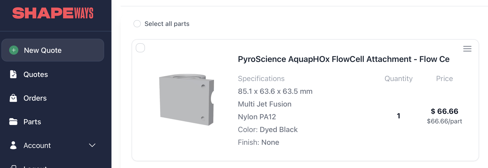

# pH Probe Notes

Current design involves a fully standalone AquapHOx-LX pH meter that is correctly timestamped to the same time zone as the operator computer, so data logs can be correlated after recovery.

### Installing the AquapHOx-LX pH logger:

The AquapHOx-LX pH logger sits after the ph probe on the fuid path.

3D print options:

- **Option 1 [Recommended]:** Print using multi-jet fusion from a commercial service such as Shapeways, Jawstec or Craft cloud with nylon  pf12 or other plain nylon material - MJF allows a watertight part that is compatible with NPT tapping and threading without cracking.
  - 

- **Option 2:** Use a standard FDM printer and with a hollow print profile and no bottom layers and fill with epoxy resin from the bottom - 
  - Follow the guidelines in this article: https://blog.prusa3d.com/watertight-3d-printing-pt1-vases-cups-and-other-open-models_48949/
  - 
  - Once printed, cut away any internal bridging filaments, flip upside down and fill with a slow cure epoxy or resin such as [MG Chemicals 832HD](https://www.digikey.com/en/products/detail/mg-chemicals/832HD-50ML/9658009)

- **Option 3:** 3D print the flow cell attachment for the AquapHOx-LX using a 100% fill FDM print with a UV-resistant filament (Least watertight option)

#### Threading

Once printed and/or hardened, drill a 'r' size pilot hole for 1/8" tap and then use a 1/8" NPT pipe tap to make threads in the input and output fluid ports - the tap should go in until there are 6-7 tap cutting threads remaining visible above the port face.

Install 1/8" NPT to Swagelok 1/4" brass or plastic tube fitting adapters into the NPT holes we just tapped with NPT threads wrapped in 3+ wraps of PTFE tape.

### Using the AquapHOx-LX pH meter:

See the Pyroscience software documentation - use the usb-to-subconn adapter cable included w the AquapHOx-LX to initialize it and begin logging - the  AquapHOx-LX is not yet integrated into the software of the ISMS and functions as a fully standalone logger.

### Alternative designs:

The onboard PCB was orignally designed to be electrically pin compatible with the [Pyroscience Pico pH Sub](https://www.pyroscience.com/en/products/all-meters/pico-ph-sub) pH Probe, however this probe requires waterproofing the back end of the bulkhead part. As such, it would need an additional oil-compensated enclosure design and subconn or integration into the main housing end cap, which was deemed to tricky while maintaining structural integrity of the main end cap at the time. Software has not been written for any pH probe but should be fairly trivial to integrate if desired following the same patterns as the other serial sensors in the codebase.

## Next Build Section: [Vehicle Integration Guide](../ISMS%20V3%20Vehicle%20Integration%20Guide.md)
