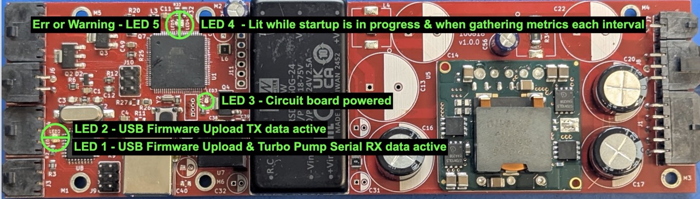
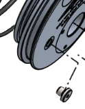

<b style="color:#9b0000; font-size: 1.7rem">Troubleshooting Guide</b>

# In-Situ Mass Spectrometer V3

## Diagnosis

### Serial Communication Issues

* No connection to ISMS or RGA or no console text shown on startup
* Garbled text on power up or not responding correctly to commands

**See [Fixing Serial Connections](#fixing-serial-connections)**

### Disconnection Issues

* RGA live plot stops scanning or shows a flat line.
* ISMS stats stop updating, commands do not work.

**See [Fixing Disconnections](#fixing-disconnections)**

### Fluid Flow Issues

* **Prevention:** Turn off fluid pump while moving the vehicle or when in sediment rich water
* RGA signal peaks become more defined and shrink over time without reason.
* No visible evidence of flow out the fluid path exhaust tube.

**See [Fixing Fluid Flow](#fixing-fluid-flow)**

### Slow Vacuum Leaks

* RGA signal floor rises to higher than expected and/or peaks start having noticeably less definition.
* RGA total pressure goes up gradually over time.
* RGA filament temperature and power draw goes up over time
* Turbo Power consumption can go DOWN slightly for slow leaks

**See [Fixing Slow Leaks](#fixing-slow-leaks)**

### Fast Vacuum Leaks

* Turbo pump takes longer than XXXXX time to reach 90,000 rpm and current stays above 1.5A after speed levels off
* RGA filament turns off or RGA software stops scanning and won’t start.
* Turbo pump amperage rises above 1.5A and/or do

**See [Fixing Fast Leaks](#fixing-fast-leaks)**

### Configuration Issues

* Turbo pump does not reach speed, but current consumption is normal (xxxxx)
* Turbo pump does not respond to commands, but other ISMS commands work as expected.
* RGA Software Buttons are greyed out.

**See [Fixing ISMS Configuration Issues](#fixing-isms-configuration-issues)**

### PC Software Issues

* Serial Studio dashboard is jumbled or empty
* RGA Software panels are missing

**See [Fixing PC Software Issues](#fixing-pc-software-issues)**

### LED Light Meanings

 The ISMS has several LED lights labeled LED1 \- LED5 that indicate board status.

* **LED 1 & LED 2:** Flashing quickly indicates that the USB-B port has data moving through it or a firmware update is in progress (this should not be lit or flash at all during normal operation)
* **LED 3:**  Indicates that the board has power on the 5v rail \- this LED should always be on while power supply “A” is plugged in. If out, check both power supplies for voltage. It could also indicate an issue with power

## Resolution

### Fixing Serial Connections

1. Add or remove a reverser/null modem to both RGA and ISMS serial cables and try again.
2. Make sure the ISMS serial is set to 9600 baud, 8 data bits, 1 stop bit, no parity, no flow control, and the correct COM port (or /dev/cu.xxxx on mac or /dev/ttyxxx on linux) is selected (you can verify this by unplugging one or the other and see which COM port remains available on the computer)
3. Make sure the RGA Serial cable is using the provided “Loopback Handshake” DB9 connector and that the RS232 to usb adapter supports the 22000xxxx bps baud rate of the RGA.
4. Make sure NO other programs that might try to connect to the serial ports are open such as the Arduino IDE, Multiple windows of the RGA software, Multiple Serial Studio connections, etc..
5. Power cycle ISMS with serial cables unplugged, then plug in both Serial to USB adapters after 10 seconds.

### Fixing Disconnections

1. Tighten all connections, make sure Subconn locking collars are in place.
2. Replace the USB to RS232 converters, null modems (if needed), power cables, etc..
3. Make sure NO other programs that might try to connect to the serial ports are open such as the Arduino IDE.
4. If these steps don’t work:
   1. Replace octopus subconn cable.
   2. Check internal terminal block connections
   3. Make sure that the ground of the ISMS is electrically isolated from the enclosure & water by checking for any metal on metal contact between parts of the sled, tubing, circuit board or vacuum system with the enclosure body.                               **\- see [Pressure Housing Opening and Sealing](#pressure-housing-opening-and-sealing)**

### Fixing Fluid Flow

1. Reverse the fluid pump - use the reverse fluid pump button in Serial Studio or send `FLUIDPUMP_RATE -100`
2. Check the sound of the pump when on deck, it should whine softly not grind \- any experience here dan xxxx?.
3. Flush fluid path with di water in both forward and reverse directions while running pump.
4. If no improvement, check for biofilms or buildup coating the membrane surface \- spray off membrane, and dry, or replace if needed \- **see [Membrane Replacement](#membrane-replacement).**

### Fixing Slow Leaks

1. Run just the roughing pump for several hours or overnight followed by the turbo pump again for several hours if heavy moisture buildup in the vacuum chamber is suspected.
2. Cap vacuum chamber at membrane inlet port and again attempt to pump down to reach a total pressure of less than xxxxx on the RGA.
   1. If this solves the issue, Replace membrane xxx and/or peek tubing between inlet and vacuum chamber.
3. Check that the cooling pad on the turbopump is making good contact with the ISMS endcap xxxxx \- this doesn't exist yet, but I think it is a good idea\!

### Fixing Fast Leaks

1. Power down RGA Filament and Turbo pump to avoid damage.
2. Run just the roughing pump for a while and retry powering the turbo pump to see if the moisture/air load goes down and the turbo can reach speed without steady high currents.
3. Inspect membrane and o-rings on inlet and consider replacing.
4. Check fittings that might have come loose.

### Fixing ISMS Configuration Issues

1. The turbo pump controller may have target rpm misconfigured or has a power limit set
   1. Send *TURBO\_RESET* to fix these problems & restore default speed setpoint, 100% power limit and other parameters.
   2. For a range of other commands to troubleshoot & configure the Turbo pump, **see [TC 80 Electronic Control Unit Manual](<./Component Manuals/Turbo Pump Control Unit Manual Pfeiffer-TC-80_Operating-Instructions.pdf>)**, Section 6
      1. Turbo pump commands can be sent in this format: *TURBO\_CMD 000 12345* Where 000 is the 3-digit parameter number and 12345 is the value to set it to as an integer, decimal, 1 for True, 0 for False, or the function number in the table.
      2. Parameters can be read from the turbo by sending a command in this format:
         *TURBO\_QUERY 000*  \-  where 000 is the 3-digit parameter number to read.
      3. If TURBO\_CMD and TURBO QUERY are insufficient the TURBO\_RAW command can be used to send raw ascii to the turbo pump over RS482, note you must encode this command by hand following the turbo pump protocol.

### Fixing PC Software Issues

1. For grayed out buttons on the RGA software, make sure the filament is on & serial

2. For issues with Serial Studio, check that the connection settings are set to Serial mode, the baud rates correct (see [Fixing Serial Connections](#fixing-serial-connections)) and the correct layout preset file is selected: [ISMS V3 Serial Studio Dashboard](#TODO), and

3.

### Fixing Power Supply Issues

1. Check that both power supply “A” and power supply “B” are connected and on at ≥ 24v and the ground wires from BOTH power supplies are connected to the tether per the topside wiring diagram, but do not otherwise make “loops” where the same ground path is connected in two places with a gap in-between or a long distance of wire (power or signal) are coiled up.
2. Check the power supply for voltage sag & noise while starting various sub components using a multimeter or oscilloscope.
3. Ensure the vacuum chamber has pumped out sufficiently (rough out for minimum 30mins to 1 hour from storage) before starting the RGA filament for measurement, otherwise you may get overpressure or undervoltage warnings in the RGA software.
4. Check that LED3 is on solidly while the instrument is powered (visible on the main board after sliding out the sled \- see [Pressure Housing Opening and Sealing](#pressure-housing-opening-and-sealing)).
5. Confirm that the voltages on the board match expectations by probing the connector labeled “J1” or “Unused power taps” in [ISMS PCB Pinouts Annotated.png](<../Fabrication/Wiring/Build Images/Internal/ISMS PCB Pinouts Annotated.png>) \- voltage mismatch here indicates a faulty DC-DC converter that should be replaced or higher than expected loads.

### Pressure Housing Opening and Sealing

1. Tip for opening the housing:
   1. Use several plastic cards like gift cards to work around the enclosure face seal of the endcap with penetrations. Wedge cards into the gap to keep creating wider stacks of cards and work around the edge similar to removing a bike tire. \- DO NOT use metal tools.
   2. If this is too difficult, use pressure to help: Unscrew the pressure relief valve and pressurize the enclosure up to 1-2 PSI \- NO HIGHER, otherwise the enclosure will turn into a cannon. The Blue Robotics vacuum plug adapter threads into the pressure relief valve hole perfectly and can be used with a suitable face o-ring to pressurize the enclosure and make it easier to pull apart.
   3. There is rarely a need to open the rear flat end cap and it should be left as is.
   4. Slide out the end cap with penetrations and internal sled as one unit, being careful not to let the inner sled metal rails past the last cross section plastic disk scratch the inner surfaces of the housing.
2. Re-sealing
   1. Wipe away debris and old grease with a lint-free cloth
   2. Use molykote 44 medium o-ring grease to lightly grease all o-rings
   3. Slide chassis assembly along with main endcap into tube, making sure the rails don’t scratch the inner surfaces of the housing.
      1. Add large desiccant packs to absorb the water vapor that will be ejected from the vacuum pumps into the housing as you go where they will fit.
   4. Remove the vent plug from the end cap:
      - 
   5. Turn the whole ISMS enclosure vertically onto the flat opposite end cap.
   6. Press down firmly, making sure the face o-ring stays centered in its groove as it goes \- extra grease on that side may help keep it in the groove.
   7. Expand the black housing clamp slightly and install over the flange clamp protrusions, then install the hose clamp over that and tighten
      - 
      - 

### Membrane Replacement

See the [main sled fabrication documentation](<../Fabrication/Main Sled/README.md#assembling-inlet>) assembling inlet section.
- When cutting membranes use a backing material like teflon board and cut 16mm discs using a cutting press, arbor press, or hammer along with a 16mm cutting circle edge punch \- an example is in the parts list tool sheet.

### Wiring Details

The recommended topside wiring is shown below:
> For more details see the topside section of the [Wiring Guide](../Fabrication/Wiring/README.md)

The full wiring of the entire ISMS instrument setup can be seen [here](<../Documentation Diagram Source Materials/Full Wiring Diagram Attempts/plantuml.png>): 
